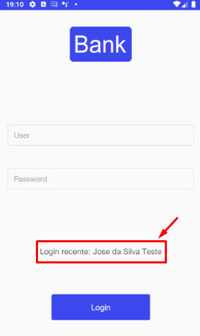

# Teste - Accenture
Projeto de teste para seleção da empresa Accenture para o cargo de Desenvolvedor Mobile Android

# Procedimentos para executação do projeto
O projeto android encontra-se na pasta "TesteAndroid".
Para execução do projeto é necessário abrí-lo na IDE Android Studio.

# Procedimentos para executação dos testes unitários
Foi implementada uma classe para realização de todos os testes unitários do sistema
em 'com.accenture.android.app.testeandroid.TestSuite'.

Basta executar esta classe e todos os testes implementados serão processados.

# Implementação
Como forma de implementação da solicitação de exibição na tela de login do último usuário salvo, foi utilizado o componente nativo da SDK do Android “SharedPreferences”.
Para exibição do último usuário salvo no sistema, foi definida na tela de Login uma pequena descrição com o nome do usuário, sendo esse buscado do SharedPreferences do smartphone. Segue exemplo:

Obs.: Caso o usuário vá para a segunda tela do aplicativo onde ele clique no botão de logout  , ele retornará para a tela de login e o nome do usuário não será apresentado, pois os dados do usuário são apagados do sistema. Para que essa descrição com o nome seja visualizada, é necessário efetuar o login ao menos uma vez no aplicativo, sair sem se deslogar (Fechar o aplicativo) e entrar novamente.
No meu entendimento, este desafio seria para testar a utilização de autenticação e a forma de guardar dados no smartphone para posterior processamento. Sendo assim, a implementação foi feita pensando em um caso de uso real, onde se o usuário não fizesse o logout, quando ele abrisse o aplicativo novamente e fosse para a tela de login já haveria dados pré-cadastrados no sistema e a autenticação seria feita de forma automática. Porém, para exemplificar, apresento apenas o nome do usuário na tela.

## Arquitetura
Para confecção do aplicativo foi utilizado a arquitetura MVP (Model View Presenter).
Essa arquitetura foi escolhida por ser um padrão amplamente utilizado em desenvolvimento mobile, com fácil entendimento e uma boa separação de responsabilidades.

Definição rápida dos diretórios criados:
* data: Contém todo o código referente a dados do sistema (Gerenciamento de consumo de APIs e conversores de dados)
* domain: Contém as classes de domínio. Nossas models, por assim dizer.
* helpers: Contém classes que irão ajudar no desenvolvimento do sistema que podem ser reutilizadas em qualquer local e que não possuem nenhuma dependência com componentes do SDK do Android (Soma, subtração, formatação de strings, etc...).
* presentation: Contém toda a lógica de cada tela, junto com seus respectivos presenters.
* utils: Contém classes que são um pouco mais complexas ou elaboradas que podem ser reutilizadas em qualquer local, porém possuem uma dependência do SDK do Android (SharedPreferences, por exemplo).

## Teste unitários
Para os testes unitários foi utilizado o JUnit por ser nativo do Java e possuir uma quantidade grande de ferramentas para serem utilizadas.

## Outras bibliotecas
Para consumo das APIs foi utilizado o framework Retrofit2. Esse framework abstrai uma boa parte da lógica de acessos HTTP e ajuda no gerenciamento das rotas que serão utilizadas.

Para listagem dos 'statements' foi utilizada a biblioteca RecyclerView.

# Show me the code

Esse repositório contem todo o material necessário para realizar o teste: 
- A especificação do layout está na pasta 'bank_app_layout' abrindo o index.html, utilizar os Styles do Android

- Os dados da Api estão mockados, os exemplos e a especificação dos serviços (login e statements) se encontram no arquivo BankApp.postman_collection.json ( é necessário instalar o postman e importar a colection https://www.getpostman.com/apps)

### # DESAFIO:

Na primeira tela teremos um formulario de login, o campo user deve aceitar email ou cpf,
o campo password deve validar se a senha tem pelo menos uma letra maiuscula, um caracter especial e um caracter alfanumérico.
Apos a validação, realizar o login no endpoint https://bank-app-test.herokuapp.com/api/login e exibir os dados de retorno na próxima tela.
O ultimo usuário logado deve ser salvo de forma segura localmente, e exibido na tela de login se houver algum salvo. 

Na segunda tela será exibido os dados formatados do retorno do login e será necessário fazer um segundo request para obter os lançamentos do usuário, no endpoint https://bank-app-test.herokuapp.com/api/statements/{idUser} que retornará uma lista de lançamentos

### # Avaliação

Você será avaliado pela usabilidade, por respeitar o design e pela arquitetura do app. É esperado que você consiga explicar as decisões que tomou durante o desenvolvimento através de commits.

Obrigatórios:

* Java ou Kotlin
* Material Design
* O app deve funcionar a partir do android 4.4
* Testes unitários, pode usar a ferramenta que você tem mais experiência, só nos explique o que ele tem de bom.
* Arquitetura a ser utilizada: Android Clean Code (https://github.com/kmmraj/android-clean-code && https://medium.com/@kmmraj/android-clean-code-part-1-c66da6551d1)
* Uso do git.

### # Observações gerais

Adicione um arquivo [README.md](http://README.md) com os procedimentos para executar o projeto.
Pedimos que trabalhe sozinho e não divulgue o resultado na internet.

Faça um fork desse desse repositório em seu Github e ao finalizar nos envie um Pull Request com o resultado, por favor informe por qual empresa você esta se candidatando.

# Importante: não há prazo de entrega, faça com qualidade!

# BOA SORTE!
